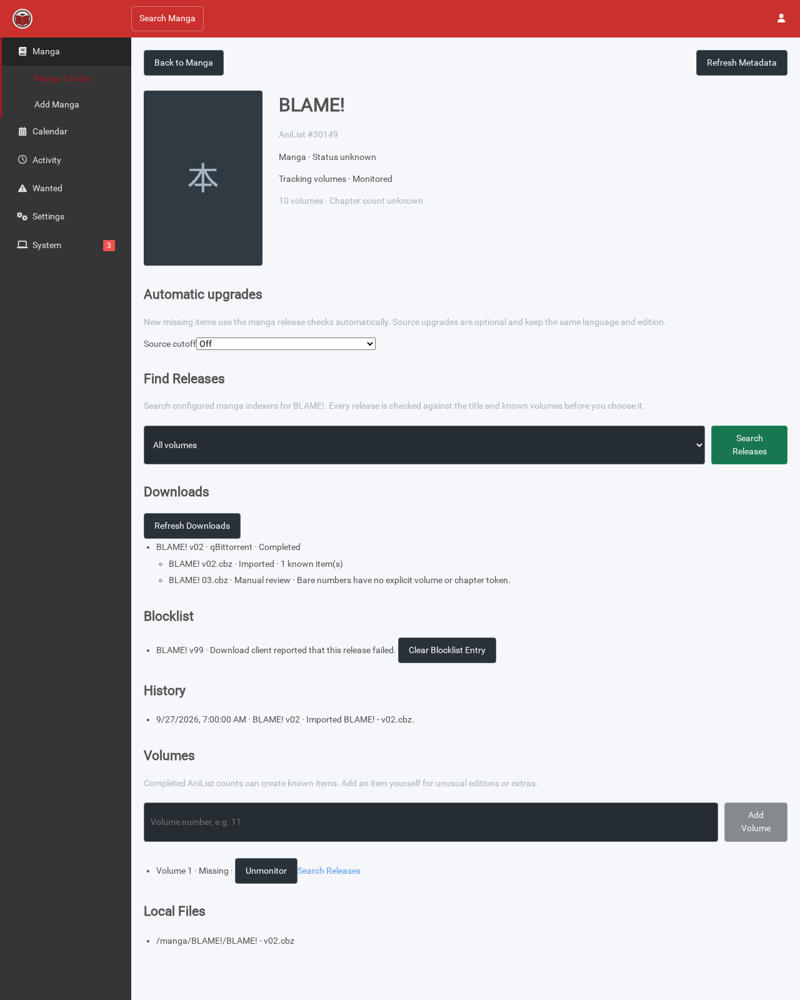
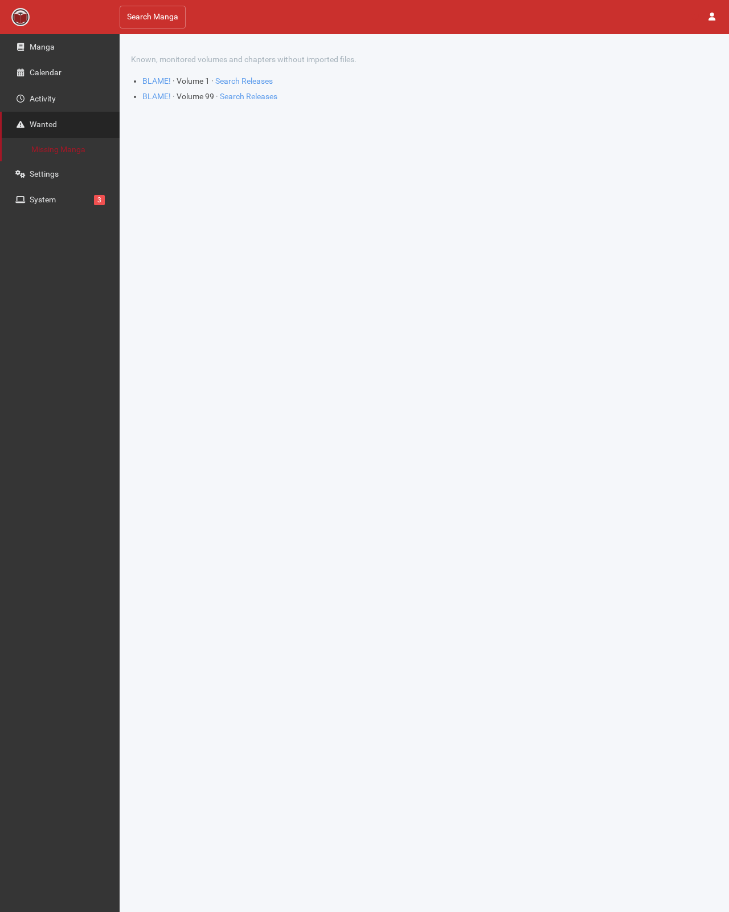
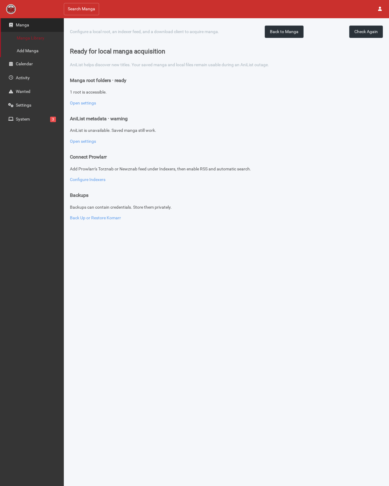

# Komarr UI preview

These screenshots come from the reproducible Playwright smoke fixture. The sample title is BLAME! and the indexer, download, and health responses are test data. Generate them with `KOMARR_SCREENSHOT_DIR=docs/screenshots ./scripts/smoke-docker.sh komarr:local --browser` after building the image.

## Manga detail and release review

## Wanted volumes

## First-run setup

